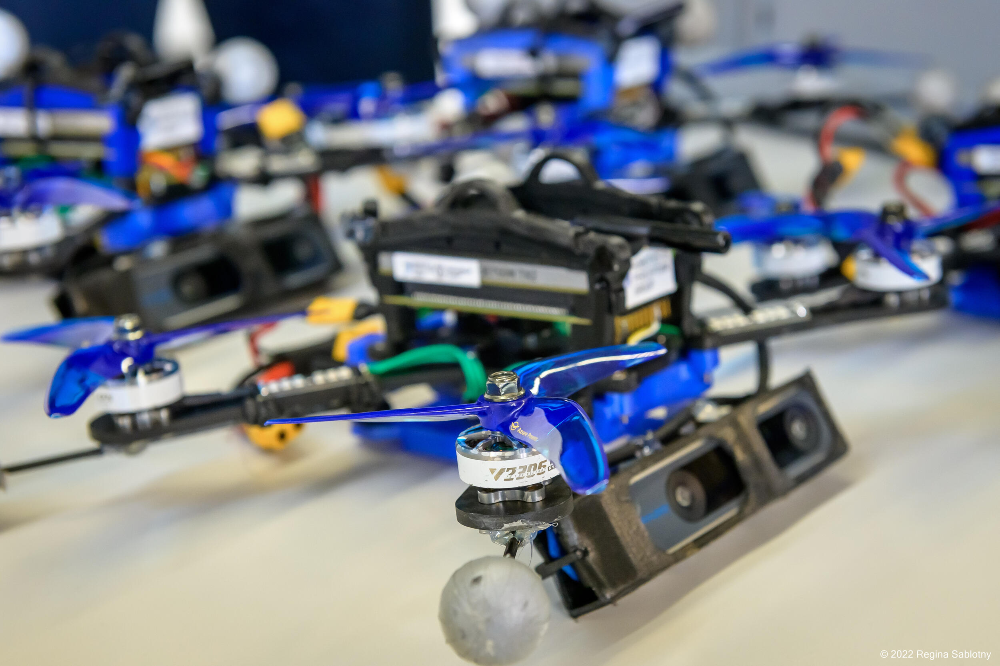
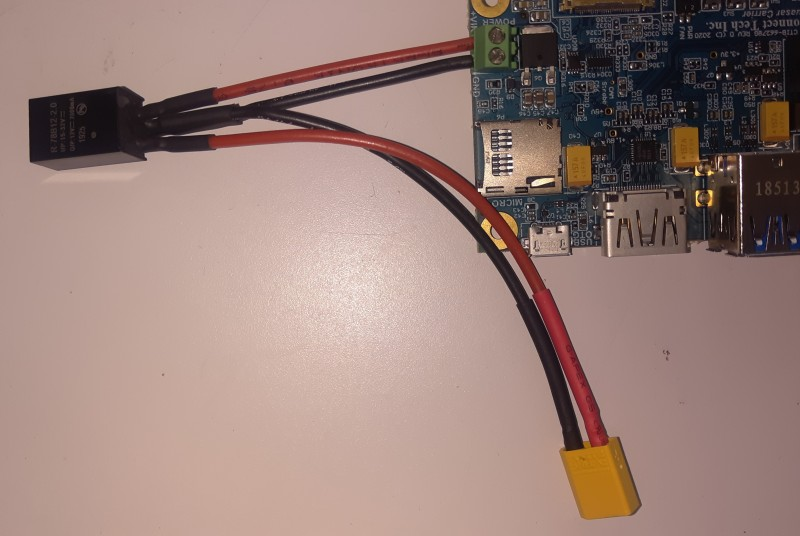
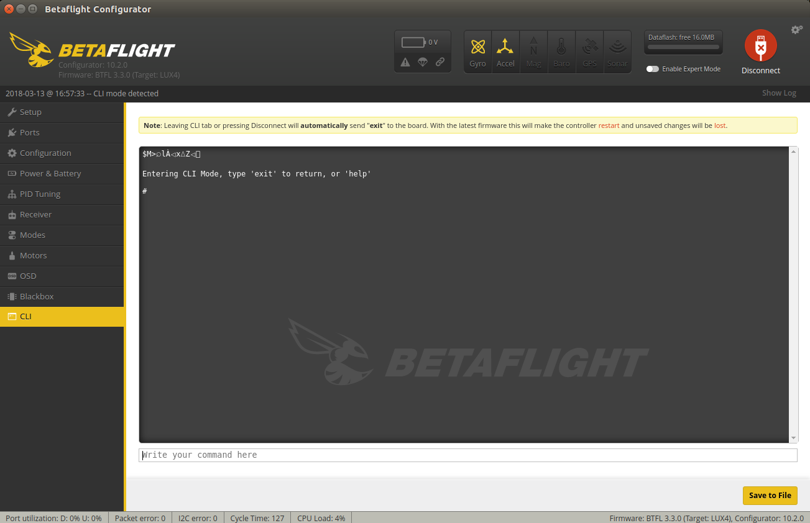

# Agilicious Hardware Platform
This step-by-step guide allows you to replicate the quadrotor research platform developed by the Robotics and Perception Group. 

1. [Buy the components](#buy-the-components)
2. [Print 3D parts](#3d-printed-parts)
3. [Assemble Quadrotor](#assemble-quadrotor)
4. [Flash Jetson and Low-Level Controller](#flash-jetson-and-controller)




## Buy the Components
Below table lists the hardware components of the Agilicious platform, accompanied by a link to order each part:

| Name                         | Description          | Link                                                                                                          | Notes                                                                          |
|------------------------------|----------------------|---------------------------------------------------------------------------------------------------------------|--------------------------------------------------------------------------------|
| Jetson TX2                   | Main compute unit    | https://developer.nvidia.com/buy-jetson                                                                       |                                                                                |
| ConnectTech Quasar           | Breakout Board       | https://connecttech.com/product/quasar-carrier-nvidia-jetson-tx2/                                             | If not two USB3.0 ports are required, the Orbitty carrier can be used as well. |
| TMotor F7 Flight Controller  | Low-Level Controller | https://www.getfpv.com/t-motor-f7-stack-f7-fc-f55a-pro-ii-3-6s-4-in-1-esc-combo.html                          |                                                                                |
| F55A Pro II 3-6S 4-in-1 ESC  | ESC                  |                                                                                                               | Ordered together with the Low-Level Controller                                 |
| Armattan Chameleon 6"        | Main Plate           | https://armattanquads.com/chameleon-6-main-plate/                                                             |                                                                                |
| TMotor Veloc V2306 V2.0      | Motors               | https://store.tmotor.com/goods.php?id=1106                                                                    |                                                                                |
| Azure Power SFP 5148         | Propeller            | https://www.drone-fpv-racer.com/en/azure-power-sfp-5148-pc-4pcs-4787.html#/1-color-blue                       |                                                                                |
| Tattu R-Line 4s 1800mAh 120C | Battery              | https://www.gensace.de/tattu-r-line-version-3-0-1800mah-14-8v-120c-4s1p-lipo-battery-pack-with-xt60-plug.html |                                                                                |
| Anti-Vibration Rubber Damper | Dampers              | https://de.aliexpress.com/item/1891055875.html (or similar)                                                   | If not flying vision-based, dampers can be omitted.                            |
| Recom Power R-78B9.0-2.0     | Voltage Converter    | https://www.digikey.ch/product-detail/de/recom-power/R-78B9-0-2-0/945-3277-ND/6677073                         |                                                                                |


## 3D-Printed Parts
All 3D-printed parts, together with a complete 3D model of the quadrotor can be found [here](https://cad.onshape.com/documents/81f2b419267a00337dc816ca/w/22f261270ecd200d75284f7e/e/a2769eb28b03773dbdd61386).

## Assemble Quadrotor

### Mechanical Setup

Sand the edges of the carbon fiber frame (so cables that touch the edges will not lose their isolation and short through conducting carbon fibers). 
If additional holes are required, drill those before mounting any other parts (take an old drill bit, they wear out quickly in carbon fiber). 
Press inserts in 3D-printed parts before mounting them (use a fitting metal bolt and the vice to do so). 
Be aware that some of the bolts are explicitly supposed to be plastic as they are mounted where the parts are supposed to break in a crash.

### Wiring & Electronics
The Jetson TX2 communicates with the low-level controller via a serial connection. The corresponding pins to be used to connect to the low-level controller are illustrated in the image below.


To use the breakout board with up to 6S batteries, we use a DC-DC converter, which also helps to smoothen voltage fluctuations when the motors are pushed to their limits. 



## Flash Jetson and Controller

### Flash Betaflight
Our SBUS bridge is intended to be used together with flight controllers which are used in first person view (FPV) racing. 
Most common flight controllers used in FPV racing are able to receive SBUS commands and can therefore be used together with our SBUS bridge. 
On these flight controllers, we use the open-source Betaflight firmware since it is easily and transparently configurable.

**Betaflight Configurator**</br>
To flash and use this firmware, you first need to install the [Betaflight Configurator](https://github.com/betaflight/betaflight-configurator) by following the steps in their installation instructions.

**Flashing the Betaflight Firmware**</br>
Flashing the Betaflight Firmware onto the flight controller (FC) can be a tedious process. We recommend to run Betaflight Configurator on Windows to flash the flight controller, as we often experienced problems when doing the process under Linux. 
1. Start BetaflightConfigurator
2. While connecting the FC to the USB port of the computer, press the _boot_ button. On some older FC boards there is no boot push-botton. In this case a pair of tweezers can be used to connect the _boot_ jumper to _GND_ during the power-on process. Once the board is on, the boot button can be released again.
3. Now, Betaflight Configurator should show the board is in "DFU Mode" as indicated on the right top part of the screen.
4. Choose a Firmware Release. We recommend 4.2.0 or 4.3.0 for best results. Now, select "Load Firmware [Online]"
5. Disable the options "Flash on connect"
6. Enable the options "No reboot sequence" (since the board is already in DFU mode) and enable "Full chip erase"
7. Click on "Flash Firmware"
8. Reconnect the board and apply the custom defaults for the board as suggested by Betaflight Configurator

**Setting the Agilicious Parameters**</br>
Some of the parameters set in the SBUS bridge in Agilicious need to correspond to the settings made on the flight controller in the Betaflight Firmware. 
We provide the Betaflight parameters that should be used together with the default settings of the SBUS bridge. 
To apply these parameters, connect your flight controller to your computer with an USB cable, 
start the Betaflight Configurator, and press Connect in the top right corner. 
Then navigate to the CLI tab which should bring you to the following view:


Then, copy all the text from our provided [Betaflight parameter file](TODO), paste it into the command line in the CLI tab of the Betaflight Configurator and hit Enter. 
Wait until all the parameters are set, then type `save` into the command line and hit Enter. 
The flight controller will reboot and should be set up to be used with the SBUS bridge and Agilicious. 
Note that the most important settings for working smoothly with our SBUS bridge are the rate curves which determine how SBUS commands are translated into body-rate commands in the firmware. 
These curves are set by parameters as described above but can still be inspected in the PID Tuning tab in the Betaflight Configurator. 
We require these curves to be linear and the respective maximum values to correspond to the the max_roll_rate, max_pitch_rate, and max_yaw_rate parameters set in the SBUS bridge parameters.


### Flash Jetson TX2
This setup assumes that you have a fresh Jetson TX2. 

**Preparing the OS image for the Jetson**</br>
1. Download the drivers for your breakout board from [here](http://connecttech.com/product/quasar-carrier-nvidia-jetson-tx2/).
   **Note:** If you use the Orbitty carrier, download the drivers from [here](https://connecttech.com/product/orbitty-carrier-for-nvidia-jetson-tx2-tx1/).
2. Open Nvidia SDK manager and install JetPack 
    - If not yet installed, download the SDK manager from [here](https://developer.nvidia.com/nvidia-sdk-manager).</br>
      ATTENTION: Do NOT install anything on the host machine, it very likely wrecks your ROS installation (for that uncheck the option to install something on your computer on the first page of the SDK)!
    - Select the target hardware and JetPack version and click through the installation process. With default settings, 
      this will download the Jetson image to ~/Downloads/nvidia/sdkm_downloads, and install it to ~/nvidia/nvidia_sdk. 
      At the end, the SDK manager will attempt to flash the Jetson. Skip this step for now.
3. Adapt Jetpack to your breakout board.
    - Copy the compressed folder downloaded in Step 1 to `~/nvidia/nvidia_sdk/JetPack_####/Linux_for_Tegra`
    - Extract the folder: `tar -xzf CTI-L4T-TX2-32.3.1-V###.tgz`
    - Change into the CTI-L4T directory:  `cd CTI-L4T`
    - Run the install script (as root or sudo) to automatically install the BSP files to the correct locations: 
      `sudo ./install.sh` after a successful installation you should see the message: `CTI-L4T-VXXX Installed!`
    - `cd ..`
4. The `CTI-L4T BSP` is now installed on the host system and you should now be able to flash the TX2.

**Disabling the Serial Console**</br>
This step is only needed when the serial console port is used for the mavlink messages to get the battery voltage feedback from the flight controller. 
The serial console port can also be disabled after flashing. 
Follow the steps [here](https://connecttech.com/resource-center/kdb347-reassigning-disable-serial-debug-connect-tech-tx1-carriers/)

**Flashing the Jetson**</br>
1. These steps explain the flashing procedure with either the NVidia Dev-Kit or with the Jetson TX2 already mounted on the ConnectTech breakout board. 
   Both breakout board types feature the required buttons (PWR, RST, REC) and support the flashing procedure. 
2. Connect the TX2 mounted on the breakout board to the computer via micro-USB and  plug in the power cable. 
   The device needs to be turned off at this point!
3. Put the system to be flashed into recovery mode
   - Power on the device by pressing the PWR-Button for 2 seconds.
   - Press and hold the REC button.
   - While depressing the REC button, press and release the RST button.
   - Wait 2 seconds and release the REC button.
4. Run `sudo ./cti-flash.sh` from `Linux_for_Tegra` directory. The script leads you through the setting. 
   After selecting the breakout board, select the Base configuration.
5. Once the flashing has completed, the TX2 will reboot. 

**Initial Setup Routine**</br>
After successfully flashing the Jetson, perform the initial setup routine. 
The easiest way to do this is by connecting it to a screen, mouse & keyboard. 

**Install CUDA/cuDNN/OpenCV/TensorRT**</br>
The add-on software packages like CUDA/cuDNN/OpenCV/ect that JetPack installs aren’t flashed over USB like L4T is.
JetPack installs those packages during the post-install steps using the network.
To do this, connect the Jetson that is either mounted on the Dev-Kit or already on the breakout board on the drone, via USB to your laptop. 
Startup the SDK manager, and only select to install the add-on software. 
In the popup-window, leave the IP as is and enter username & pw (that you configured in the previous step) of the Jetson. 

**Final Steps**</br>
Almost done! Here are some last steps before your Jetson is ready to take off:

- To make your new Jetson ready for autonomous flight with Agilicious, you need to install ROS, follow the official instructions for this. 
- If you want to use the serial port on the Jetson, add the user to the `dialout` group: 
  ```
  sudo usermod -a -G dialout $USER
  ```

Back to [Getting Started](https://github.com/uzh-rpg/agilicious/blob/main/README.md#getting-started).